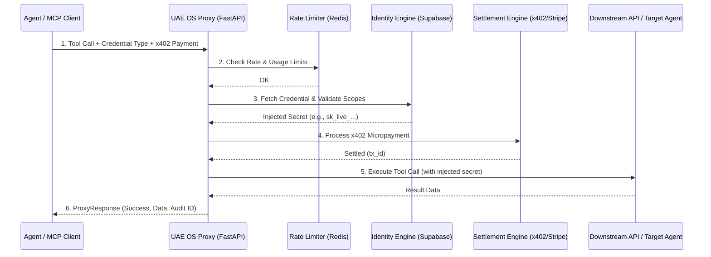

# Universal Agent Economy OS - Architecture & Security

This document outlines the core architecture of the Universal Agent Economy OS, designed specifically for enterprise acquirers and new maintainers. It details the request flow, modular components, and our robust security posture—specifically addressing Model Context Protocol (MCP) STDIO vulnerabilities.

## 1. High-Level Architecture

The Universal Agent Economy OS operates as a high-performance, secure proxy between autonomous agents (A2A) and downstream APIs or tools. It intercepts requests to enforce identity, validate cryptographic scopes, and settle x402 micropayments before execution.

## 2. Core Modules

*   **Proxy Engine (`app/proxy.py`)**: The central orchestrator. It handles the request lifecycle, ensuring that rate limits, identity, and settlement are all verified before any downstream execution occurs.
*   **Identity Engine (`app/identity/`)**: Manages agent registration and credential storage. It dynamically validates requested scopes against the loaded **Vertical Credential Packs** (Finance, Healthcare, Logistics, etc.).
*   **Settlement Engine (`app/middleware/x402.py`, `app/payments.py`)**: Intercepts requests requiring payment. It enforces paid discovery and handles real-time settlement via Stripe or Lightning networks.
*   **A2A Router (`app/routing.py`)**: Resolves target agent endpoints from the `.well-known/agent-card.json` discovery metadata, enabling direct Agent-to-Agent communication.

## 3. Internal Security Notes: MCP STDIO Vulnerability Protection

As the agentic economy scales, many agents operate over the **Model Context Protocol (MCP)** using standard input/output (STDIO) streams. While efficient for local or containerized execution, STDIO streams present unique security challenges in enterprise environments (e.g., Healthcare, Logistics, Ad-Tech).

### The Vulnerability
When operating over MCP STDIO, agent prompts, context, and outputs are passed via raw text streams. If an agent is compromised or subjected to a prompt injection attack, a malicious actor could attempt to exfiltrate sensitive data (like PII, PHI, or raw API keys) by logging or redirecting these streams.

### The UAE OS Mitigation Strategy
The Universal Agent Economy OS is architected to completely neutralize this threat vector for enterprise acquirers:

1.  **Server-Side Credential Injection**: Raw secrets (API keys, OAuth tokens) **never** touch the potentially vulnerable MCP STDIO streams of the client agents. The client agent only knows the `credential_type` (e.g., `stripe_live`, `ehr_system_access`). The proxy injects the actual cryptographic secret server-side, just milliseconds before the downstream HTTP request is made.
2.  **Strict Least-Privilege Scope Enforcement**: Even if an attacker compromises an agent's STDIO stream and attempts to use its identity to make unauthorized proxy calls, the Identity Engine enforces strict cryptographic scopes *before* execution. An agent granted only `audit:read` cannot execute a `payment:write` action, regardless of the prompt injection.
3.  **Immutable Audit Logging**: Every proxy execution, successful or failed, generates a unique `adt_` ID and is logged immutably. This provides a clear, auditor-ready trail of exactly which agent attempted which action, satisfying stringent compliance requirements (SOC2, HIPAA, GDPR).
4.  **Self-Healing Auto-Rotation**: To further reduce key-person risk and limit the blast radius of any potential compromise, the Identity Engine supports automated, high-frequency credential rotation (e.g., `auto_rotate_agent_credentials`), ensuring that even server-side secrets are ephemeral.

This defense-in-depth approach ensures that the Universal Agent Economy OS remains the most secure foundation for enterprise agentic operations.